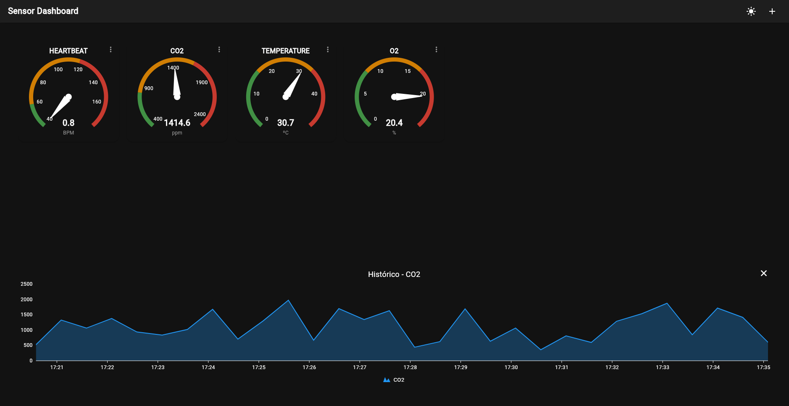
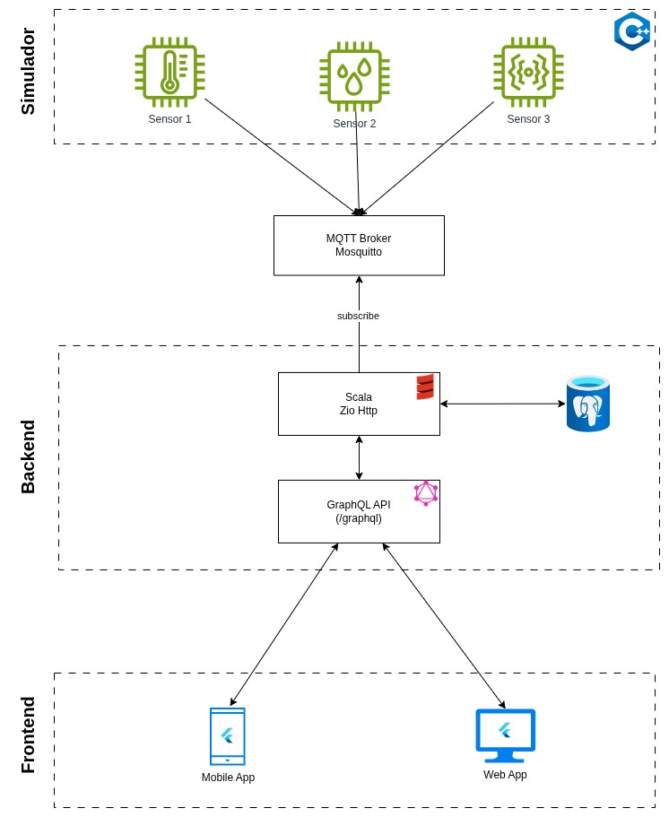
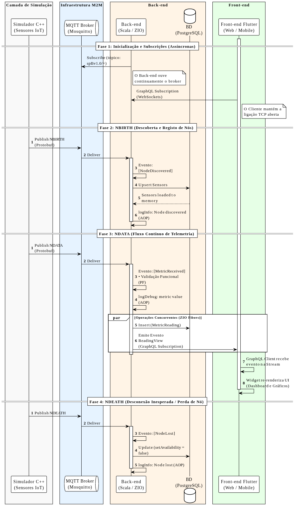

<h1 align="center">Practical Work on Paradigmas Emergentes para o Desenvolvimento Web e Mobile (Emerging Paradigms for Web and Mobile Development)</h1>

  
  
  

---

## Real-Time IoT Dashboard

A real-time IoT Dashboard application designed to monitor and visualize sensor data seamlessly. Built with a reactive **Scala (ZIO)** backend and a **Flutter** frontend, utilizing **MQTT (Sparkplug B)** for device communication and **GraphQL Subscriptions** for real-time UI updates. 

Developed for the Master's in Informatics Engineering.

### Authors
* Diogo Pereira
* Hugo Guimarães

---

## Tech Stack

**Frontend (Web & Mobile):**
* Flutter & Dart
* GraphQL Subscriptions (WebSockets)
* Provider (State Management)
* Custom Interactive Dashboard Grid

**Backend & Infrastructure:**
* Scala & ZIO (Reactive Functional Programming)
* PostgreSQL (Time-series data storage)
* MQTT / Eclipse Mosquitto (Sparkplug B Protocol)
* Docker & Docker Compose

---

## Web Screenshots

  
   
  <em>Main Dashboard with real-time sensor gauges and time-series charts.</em>

---

## High-Level Architecture

The system follows a reactive, event-driven architecture designed for high scalability and real-time updates without blocking threads.

  

1. **Sensors / Simulator:** Publish telemetry data via MQTT using the Sparkplug B standard.
2. **Backend (Scala/ZIO):** Subscribes to MQTT topics, processes incoming `NDATA`/`NBIRTH` payloads concurrently using lightweight Fibers, persists history in PostgreSQL, and pushes updates.
3. **Frontend (Flutter):** Subscribes to the GraphQL endpoints via WebSockets to instantly reflect changes on the interactive dashboard.

---

## Sequence Diagram

  

